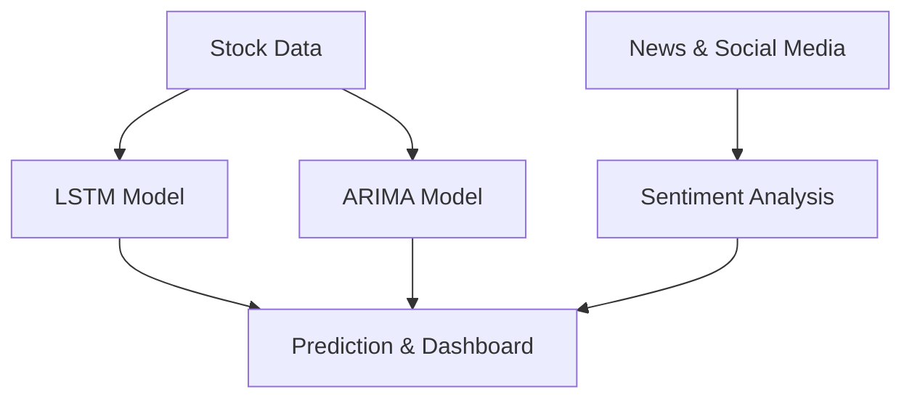

# 📈 Stock Market Prediction System

## 🔍 AI-Based Stock Price Forecasting with Sentiment Analysis

## 🚀 Project Overview
The **Stock Market Prediction System** leverages AI and machine learning models to predict stock prices using **LSTM, ARIMA**, and **sentiment analysis**. It integrates historical stock data with real-time news and social media sentiment to provide actionable insights for investors.

## 🎯 Key Features
✅ **Hybrid Model (LSTM + ARIMA):** Combines deep learning with statistical models for short and long-term predictions.  
✅ **Sentiment Analysis:** Uses VADER to analyze financial news and social media sentiment.  
✅ **Correlation Analysis:** Studies the impact of market sentiment on stock price fluctuations.  
✅ **Real-Time Data Integration:** Fetches stock data from Yahoo Finance and sentiment from news sources.  
✅ **Interactive Dashboard:** Built with **Streamlit** and **Plotly** for visualizing trends.  

## 📊 Methodology
1. **Data Collection:**  
   - Stock prices from Yahoo Finance.  
   - Sentiment data from news and Twitter.  
2. **Exploratory Data Analysis (EDA):**  
   - Historical trends and volatility analysis.  
3. **Predictive Modeling:**  
   - **LSTM**: Captures non-linear stock trends.  
   - **ARIMA**: Handles linear stock patterns.  
   - **Sentiment Analysis:** Determines market mood (positive, neutral, negative).  
4. **Visualization & Interpretation:**  
   - Displays price trends, sentiment insights, and correlations.  

## 📌 System Architecture

## 🛠 Tech Stack
- **Python** (NumPy, Pandas, Matplotlib, Seaborn)  
- **Machine Learning** (TensorFlow, scikit-learn)  
- **Time-Series Analysis** (ARIMA, LSTM)  
- **NLP** (VADER Sentiment Analysis)  
- **Data Visualization** (Streamlit, Plotly)  

## 🎯 Future Enhancements
🔹 Real-time market monitoring with **live updates**  
🔹 Advanced NLP models (**BERT**) for better sentiment analysis  
🔹 Reinforcement learning for **adaptive trading strategies**  

## 👨‍💻 Authors
- **Yash Sharma**  
- **Astha Rai**  
- **Kushagra Gangwar**  
